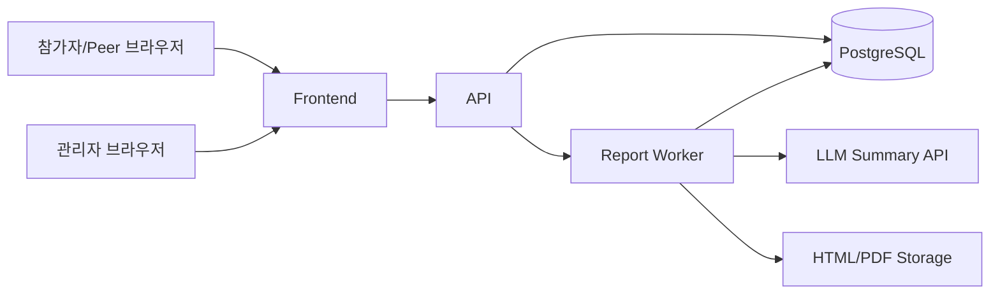

# 배포형 서비스 아키텍처

## 목표
현재 `site-mvp`의 브라우저 저장형 웹앱을, 실제 참가자에게 링크를 배포하고 운영자가 응답 현황과 리포트를 관리할 수 있는 서비스형 구조로 확장한다.

## 권장 스택
- Frontend: Next.js App Router
- Backend API: Next.js Route Handler 또는 별도 Fastify API
- DB: PostgreSQL
- ORM: Prisma
- Queue/Batch: 서버 크론 또는 백그라운드 잡
- File Output: HTML 저장 + PDF 렌더링
- LLM: OpenAI Responses API 또는 Chat Completions 기반 요약
- Auth: 관리자만 로그인, 참가자/Peer는 서명된 토큰 링크 사용

## 사용자 역할
- 관리자
  - 명단 업로드
  - Peer assignment 업로드/검증
  - 링크 배포
  - 응답 현황 조회
  - 리포트 생성/다운로드
- 참가자(자가진단)
  - 본인 링크로 자가진단 1회 제출
- Peer 응답자
  - 본인 전용 링크로 4명 평가 후 최종 제출
- 리포트 열람자
  - 본인 리포트 링크로 개인 리포트 열람

## 페이지 구조
- `/admin/login`
- `/admin/dashboard`
- `/admin/participants`
- `/admin/reports`
- `/self/:token`
- `/peer/:token`
- `/report/:token`
- `/done`

## 핵심 흐름
1. 관리자가 참가자와 Peer assignment 데이터를 업로드한다.
2. 시스템이 self/peer/report 토큰을 생성한다.
3. 운영자는 메일 또는 메신저로 링크를 배포한다.
4. 참가자는 자가진단을 제출한다.
5. Peer 응답자는 배정된 4명을 순서대로 평가하고 최종 제출한다.
6. 시스템은 응답 완료 상태를 집계한다.
7. 자가진단과 Peer 응답이 모두 갖춰지면 리포트를 자동 계산한다.
8. 리포트 텍스트 요약은 LLM으로 생성하고, HTML/PDF로 저장한다.

## 배포형 컴포넌트 구조

## 운영 관점의 분리 포인트
- `Survey API`
  - self response 저장
  - peer response 저장
  - token 검증
- `Admin API`
  - 참가자/배정 업로드
  - 응답 현황 집계
  - 링크 재발급
- `Report API / Worker`
  - Peer 코멘트 묶기
  - LLM 요약 호출
  - 리포트 HTML/PDF 생성
  - 생성 이력 보관

## 토큰 전략
- self token: participant 1명당 1개
- peer token: responder 1명당 1개
- report token: participant 1명당 1개
- 토큰은 랜덤 문자열 + 만료 없음 또는 운영 종료 시 비활성화
- 토큰 링크에는 이름/ID를 노출하지 않음

## 상태 모델
- self response status
  - not_started
  - draft
  - submitted
- peer response status
  - not_started
  - in_progress
  - submitted
- report status
  - waiting_self
  - waiting_peer
  - ready
  - exported

## 추천 운영 순서
1. D-14: 명단 업로드, Peer assignment 업로드
2. D-13: 링크 일괄 생성 및 배포
3. D-7 ~ D-1: 응답 리마인드, 대시보드 점검
4. D-1: 리포트 일괄 사전 생성
5. 당일: 관리자 화면에서 최종 완료 여부 확인, 리포트 배포

## 현재 MVP와의 대응 관계
- `self-survey.html` -> `/self/:token`
- `peer-survey.html` -> `/peer/:token`
- `report-viewer.html` -> `/report/:token`
- `admin-dashboard.html` -> `/admin/dashboard`
- `common.js`의 집계 로직 -> API/worker service layer

## 우선 구현 권장 순서
1. DB/토큰/API부터 구현
2. 자가진단/Peer 제출 저장
3. 운영 대시보드 집계
4. 리포트 HTML 자동 계산
5. LLM 요약 연결
6. PDF 저장/배포
